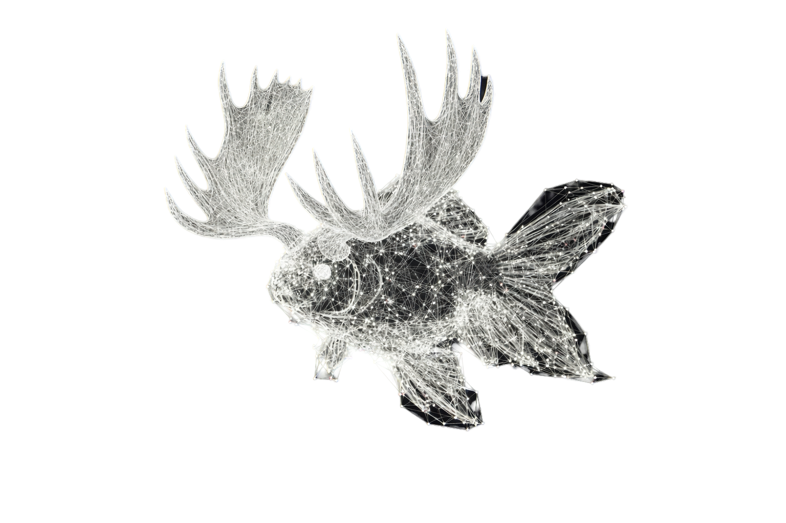

<p align="center">
  
</p>

# HippoGraph Pro

> ⚠️ **Under Active Development** — This is a research fork, not production-ready.
> Features may break, APIs may change, benchmarks are preliminary.
> For a stable self-hosted memory system, see [HippoGraph](https://github.com/artemMprokhorov/hippograph).

---

## What Is This?

**HippoGraph Pro** is the experimental research branch of [HippoGraph](https://github.com/artemMprokhorov/hippograph) — a self-hosted, graph-based semantic memory system for AI assistants via MCP.

While the base project provides a stable, zero-dependency memory layer, **Pro** is where we push boundaries: better retrieval algorithms, smarter entity extraction, and research into AI memory architectures.

### How It Differs from HippoGraph (Base)

| | **HippoGraph** (Base) | **HippoGraph Pro** |
|---|---|---|
| **Purpose** | Stable personal memory | Research & experimentation |
| **Status** | Production-ready | 🚧 Under construction |
| **Entity extraction** | spaCy + regex | GLiNER zero-shot NER + Ollama LLM + spaCy fallback |
| **Search** | Semantic + spreading activation | + BM25 hybrid + cross-encoder reranking + RRF fusion |
| **Benchmarks** | Internal tests | LOCOMO: 44.2% Recall@5 · E2E QA: 38.7% F1 (zero retrieval cost) |
| **Dependencies** | Minimal (Docker only) | + Ollama sidecar (optional), GLiNER model |
| **Graph analytics** | Basic viewer | + PageRank node sizing, community coloring |
| **Temporal model** | Created/accessed timestamps | + Bi-temporal (event time extraction) |
| **Target audience** | Anyone wanting AI memory | Researchers, contributors, the curious |

---

## 🔬 Research Focus

This project explores several questions:

- **Retrieval quality**: Can spreading activation + BM25 + semantic search match LLM-powered systems at zero inference cost?
- **Entity extraction trade-offs**: GLiNER (250ms, LLM quality) vs Ollama 7B (6s, generation capable) vs spaCy (10ms, basic) — what's the right tool for each job?
- **Benchmark-driven development**: How does a lightweight graph memory compare to Mem0, Zep/Graphiti, and Letta on standardized benchmarks?

### Current Benchmarks

**Retrieval — LOCOMO (turn-level, zero LLM cost):**

```
| Category    | Recall@5 | MRR   |
|-------------|----------|-------|
| Overall     | 44.2%    | 0.304 |
| Single-hop  | 37.9%    | 0.227 |
| Multi-hop   | 52.6%    | 0.394 |
| Temporal    | 22.9%    | 0.139 |
| Open-domain | 45.5%    | 0.314 |
```

**End-to-End QA — HippoGraph internal dataset (1,311 pairs, Claude Haiku generation):**

```
| Category     | F1    | ROUGE-1 |
|--------------|-------|---------|
| Overall      | 38.7% | 66.8%   |
| Factual      | 40.2% | 67.6%   |
| Temporal     | 29.2% | 58.5%   |
| Entity       | 24.9% | 64.5%   |
```

> GPT-4 without memory: F1=32.1% — HippoGraph +6.6pp with zero retrieval LLM cost.
> ⚠️ Mem0 (J-score 66.9%) and Letta (74.0%) use different metrics — not directly comparable.
> See [BENCHMARK.md](BENCHMARK.md) for full methodology.

---

## 🏗️ Architecture

### Entity Extraction Chain

```
Input text
    ↓
GLiNER (primary) ─── zero-shot NER, ~250ms, custom entity types
    ↓ fallback
spaCy NER ────────── basic extraction, ~10ms, fixed entity types
    ↓ fallback
Regex ────────────── dictionary matching only
```

### Search Pipeline

```
Query → Embedding → ANN Search (HNSW)
                        ↓
             Spreading Activation (3 iterations, decay=0.7)
                        ↓
             BM25 Keyword Search (Okapi BM25)
                        ↓
             Blend: α×semantic + β×spreading + γ×BM25
                        ↓
             Cross-Encoder Reranking (optional)
                        ↓
             Temporal Decay → Top-K Results
```

### Infrastructure

```
┌─────────────────────┐
│  hippograph          │
│  (main container)    │
│                      │
│  Flask API :5001     │
│  Graph Viewer :5002  │
│  SQLite + FAISS      │
│  GLiNER + spaCy      │
│  sentence-transformers│
└─────────────────────┘
```

---

## 🚀 Quick Start

> **Prerequisites:** Docker & Docker Compose, 4GB+ RAM

```bash
git clone https://github.com/artemMprokhorov/hippograph-pro.git
cd hippograph-pro
cp .env.example .env
# Edit .env: set NEURAL_API_KEY and ENTITY_EXTRACTOR=gliner

docker-compose up -d

# Verify
curl http://localhost:5001/health
```

**Graph Viewer:** `http://localhost:5002`

---

## 📋 Pro-Only Features

Features added on top of HippoGraph base:

| Feature | Status | Description |
|---------|--------|-------------|
| GLiNER NER | ✅ Deployed | Zero-shot entity extraction, 35x faster than LLM |
| BM25 Hybrid Search | ✅ Deployed | Three-signal blend scoring (semantic + graph + keyword) |
| RRF Fusion | ✅ Deployed | Reciprocal Rank Fusion as alternative to weighted blend |
| Cross-Encoder Reranking | ✅ Deployed | ms-marco-MiniLM precision improvement |
| PageRank + Communities | ✅ Deployed | Graph analytics in viewer |
| Bi-Temporal Model | ✅ Deployed | Event time extraction for temporal queries |
| LOCOMO Benchmark | ✅ Complete | Standardized evaluation framework |
| Sleep-Time LLM Compute | 🔄 In Progress | Re-extract entities, discover connections |
| Hierarchical Tree Index | 📋 Research | Top-down navigation via community trees |
| Temporal Reasoning | 📋 Research | LLM-powered temporal query answering |
| End-to-End QA | 📋 Planned | Answer generation for benchmark comparison |

---

## 📊 Competitive Landscape

See [competitive_analysis.md](competitive_analysis.md) for detailed comparison with Mem0, Zep/Graphiti, Letta, and others.

**Our niche:** Self-hosted, zero-LLM-cost retrieval, graph-based associative memory. The only project combining spreading activation with hybrid BM25 search and zero-shot NER at zero API cost.

---

## 📖 Documentation

- [BENCHMARK.md](BENCHMARK.md) — LOCOMO benchmark results and methodology
- [ROADMAP_PRO.md](ROADMAP_PRO.md) — Development roadmap
- [THIRD_PARTY_LICENSES.md](THIRD_PARTY_LICENSES.md) — Third-party dependencies and licenses
- [competitive_analysis.md](competitive_analysis.md) — Market positioning
- [docs/](docs/) — Setup guides, API reference, troubleshooting

---

## 📄 License

Dual-licensed: MIT for open-source/personal use, commercial license required for business use.
See [LICENSE](LICENSE) for details. Contact: system.uid@gmail.com

---

## 👥 Authors

**Artem Prokhorov** — Creator and primary author

Developed through human-AI collaboration with Claude (Anthropic).
Major architectural decisions, benchmarking, and research direction by Artem.

Built with 🧠 and 🐟 (the [goldfish with antlers](https://github.com/artemMprokhorov/hippograph))
